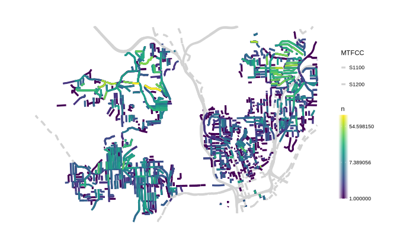

# Cincinnati Shotspotter

This R code creates the `shotspotter` data resource, which is the timing and location of gunshots detected by the shotspotter system in Cincinnati, OH.  All [police calls for service](https://data.cincinnati-oh.gov/safety/PDI-Police-Data-Initiative-Police-Calls-for-Servic/gexm-h6bt) are filtered to shotspotter reports that resulted in a police response and had a known location and date.

The "x_address" provided by the city is converted to possible street range lines from the census bureau using text matching for street names and comparison of street number ranges.  It is possible for an "x_address" range to have more than one intersection census street range file, which are stored in the `street_ranges` list-col, alongside the `address_x` column and the `date_time` column. 94% (n=11,071) of all 11,781 records were matched to at least one census street range geography.

Below is a map of the total number of shots detected in each street range approximation in Avondale, East Price Hill, and West Price Hill:

